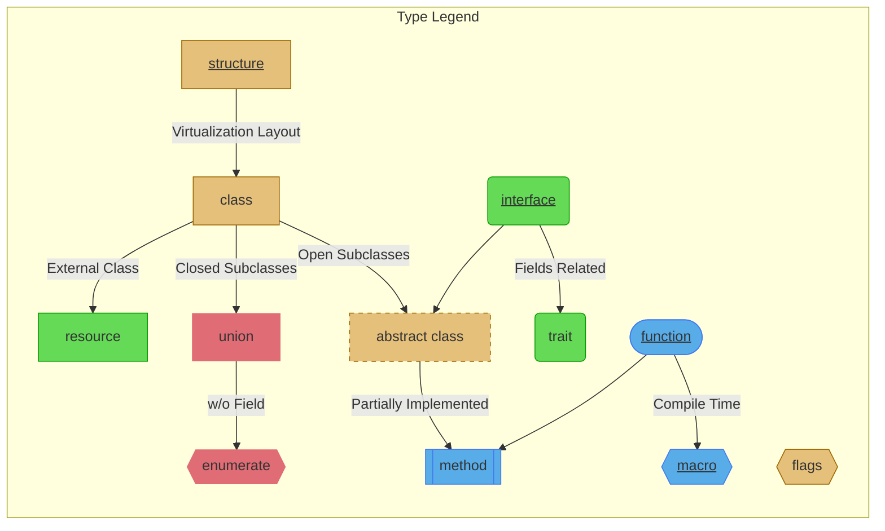

```mermaid
flowchart TB
    classDef structure fill:#E5C07B,stroke:#9f6700,text-decoration:underline;

    classDef classes   fill:#E5C07B,stroke:#9f6700
    classDef abstract  fill:#E5C07B,stroke:#9f6700,stroke-dasharray: 5 5
    classDef flags     fill:#E5C07B,stroke:#9f6700

    classDef variant   fill:#E06C75,stroke:#FFFFFF00
    classDef enumerate fill:#E06C75,stroke:#FFFFFF00

    classDef interface fill:#64da57,stroke:#079900,text-decoration:underline;
    classDef trait     fill:#64da57,stroke:#079900
    classDef resource  fill:#64da57,stroke:#079900

    classDef function  fill:#58ade9,stroke:#4078F2,text-decoration:underline;
    classDef method    fill:#58ade9,stroke:#4078F2

    subgraph "Type Legend"
    direction TB
    
    structure["structure"]:::structure
    classes["class"]:::classes
    abstract["abstract class"]:::abstract
    resource["resource"]:::resource
    variant["union"]:::variant
    
    interface("interface"):::interface
    trait("trait"):::trait

    enumerate{{"enumerate"}}:::enumerate
    flags{{flags}}:::flags

    function([function]):::function
    macro{{macro}}:::function
    method[[method]]:::method

    structure -->|Virtualization Layout| classes
    classes -->|Open Subclasses| abstract
    classes  -->|Closed Subclasses| variant
    classes -->|External Class| resource

    interface -->|Fields Related| trait
    interface --> abstract

    variant -->|w/o Field| enumerate

    function -->|Compile Time| macro 
    abstract -->|Partially Implemented| method
    function --> method

    end
```